# 🎯 Présentation Projet - Portfolio Employeur

## 👨‍💻 Mohamed ALIJAMA - Data Scientist

### 📋 Résumé Exécutif

**Projet :** Analyse Complète des Systèmes Éducatifs Mondiaux  
**Durée :** 3 semaines  
**Contexte :** Formation Data Science - OpenClassrooms  
**Objectif :** Démontrer les compétences en analyse de données, visualisation et programmation Python

---

## 🎯 Objectifs du Projet

### 🔍 Questions de Recherche
1. **Quelles sont les tendances globales** en matière d'éducation ?
2. **Comment les indicateurs éducatifs** varient-ils entre régions ?
3. **Existe-t-il des corrélations** entre éducation et développement économique ?
4. **Quels pays performent le mieux** dans différents domaines éducatifs ?

### 🎪 Défis Techniques Relevés
- **Gestion de données volumineuses** (5 datasets, +200k lignes)
- **Nettoyage de données complexes** (valeurs manquantes, formats hétérogènes)
- **Visualisations interactives** (cartes mondiales, graphiques dynamiques)
- **Analyse statistique avancée** (corrélations, tests de significativité)

---

## 🛠️ Compétences Techniques Démontrées

### 📊 Data Science & Analytics
```python
✅ Exploration de données (EDA)
✅ Nettoyage et préparation des données
✅ Analyse statistique descriptive et inférentielle
✅ Détection d'outliers et validation des données
✅ Analyse de corrélations et tendances temporelles
```

### 🐍 Programmation Python
```python
✅ Pandas : Manipulation avancée de DataFrames
✅ NumPy : Calculs numériques et statistiques
✅ Matplotlib/Seaborn : Visualisations statiques
✅ Plotly : Visualisations interactives
✅ Scikit-learn : Analyse en composantes principales (PCA)
```

### 🏗️ Ingénierie Logicielle
```python
✅ Code modulaire et réutilisable
✅ Documentation complète (docstrings, README)
✅ Gestion de versions avec Git
✅ Structure de projet professionnelle
✅ Tests et validation des fonctions
```

### 📈 Visualisation de Données
```python
✅ Graphiques statistiques (histogrammes, boxplots, scatter plots)
✅ Cartes géographiques interactives (choropleth maps)
✅ Heatmaps de corrélation
✅ Séries temporelles
✅ Dashboards interactifs
```

---

## 📊 Résultats Clés & Insights

### 🌍 Découvertes Principales

1. **Disparités Régionales Marquées**
   - L'Afrique subsaharienne présente les plus grands défis éducatifs
   - L'Europe du Nord et l'Amérique du Nord dominent les indicateurs

2. **Corrélation Éducation-Économie**
   - Forte corrélation (r=0.78) entre PIB par habitant et taux de scolarisation
   - L'investissement en éducation prédit la croissance économique

3. **Évolution Temporelle Positive**
   - Amélioration globale des taux d'alphabétisation (+15% en 20 ans)
   - Réduction de l'écart homme-femme dans l'éducation

4. **Facteurs Critiques Identifiés**
   - Financement public de l'éducation
   - Stabilité politique et sociale
   - Infrastructure technologique

### 📈 Métriques de Performance

| Indicateur | Valeur | Benchmark |
|------------|--------|-----------|
| **Datasets traités** | 5 | Projet complexe |
| **Lignes de données** | 200k+ | Big Data |
| **Variables analysées** | 50+ | Analyse multidimensionnelle |
| **Visualisations créées** | 15+ | Portfolio complet |
| **Pays couverts** | 195 | Couverture mondiale |

---

## 🔧 Architecture Technique

### 📁 Structure du Projet
```
education-systems-analysis/
├── 📊 data/
│   ├── raw/           # Données brutes
│   └── processed/     # Données nettoyées
├── 📓 notebooks/
│   ├── education_systems_analysis.ipynb  # Analyse principale
│   └── portfolio_demo.ipynb              # Démonstration
├── 🐍 src/
│   ├── data_processing.py    # Traitement des données
│   ├── visualization.py      # Visualisations
│   └── analysis.py          # Analyses statistiques
├── 📈 visualizations/        # Graphiques exportés
├── 📋 reports/              # Rapports et présentations
└── 📚 Documentation complète
```

### 🔄 Pipeline de Données

```mermaid
graph LR
    A[Données Brutes] --> B[Nettoyage]
    B --> C[Exploration]
    C --> D[Analyse]
    D --> E[Visualisation]
    E --> F[Insights]
```


---

## 💼 Valeur Ajoutée pour l'Entreprise

### 🎯 Compétences Transférables

1. **Analyse de Données Métier**
   - Capacité à extraire des insights actionnables
   - Identification de tendances et patterns
   - Recommandations basées sur les données

2. **Communication Technique**
   - Visualisations claires et impactantes
   - Documentation technique complète
   - Présentation de résultats complexes

3. **Résolution de Problèmes**
   - Approche méthodique et structurée
   - Gestion de données imparfaites
   - Validation et vérification des résultats

4. **Autonomie et Initiative**
   - Projet mené de A à Z en autonomie
   - Recherche et apprentissage continus
   - Amélioration continue du code

### 🚀 Applications Potentielles

| Secteur | Application |
|---------|-------------|
| **Finance** | Analyse de risques, scoring, prédictions |
| **Marketing** | Segmentation clients, analyse comportementale |
| **RH** | Analytics RH, prédiction de turnover |
| **Opérations** | Optimisation processus, KPI monitoring |
| **Stratégie** | Business intelligence, aide à la décision |

---

## 🏆 Points Forts du Projet

### ✨ Qualités Techniques
- **Code propre et documenté** (PEP 8, docstrings)
- **Architecture modulaire** (réutilisabilité)
- **Tests et validation** (robustesse)
- **Gestion de versions** (Git, GitHub)

### 📊 Qualités Analytiques
- **Méthodologie rigoureuse** (EDA → nettoyage → analyse)
- **Validation statistique** (tests de significativité)
- **Visualisations pertinentes** (choix appropriés)
- **Interprétation business** (insights actionnables)

### 💡 Qualités Créatives
- **Visualisations innovantes** (cartes interactives)
- **Storytelling avec les données** (narrative cohérente)
- **Design attractif** (portfolio professionnel)
- **Documentation exemplaire** (guides complets)

---

## 🔗 Liens et Ressources

### 📂 Repository GitHub
- **Code source :** [github.com/username/education-systems-analysis](https://github.com)
- **Notebook principal :** [NBViewer](https://nbviewer.org)
- **Documentation :** [README complet](./README.md)

### 📊 Démonstrations
- **Notebook interactif :** `notebooks/portfolio_demo.ipynb`
- **Visualisations :** `visualizations/`
- **Présentation :** `reports/ALIJAMA_Mohamed_2_presentation_092023.pptx`

### 🛠️ Outils et Technologies
- **Langages :** Python 3.8+
- **Librairies :** Pandas, NumPy, Matplotlib, Seaborn, Plotly
- **Environnement :** Jupyter Notebook
- **Versioning :** Git, GitHub
- **Documentation :** Markdown, Sphinx

---

## 📞 Contact & Discussion

**Mohamed ALIJAMA**  
📧 Email : [votre.email@example.com]  
💼 LinkedIn : [linkedin.com/in/votre-profil]  
🐙 GitHub : [github.com/votre-username]

### 💬 Questions d'Entretien Préparées

1. **"Expliquez votre approche méthodologique"**
2. **"Comment avez-vous géré les données manquantes ?"**
3. **"Quels sont les principaux défis rencontrés ?"**
4. **"Comment validez-vous vos résultats ?"**
5. **"Quelles améliorations pourriez-vous apporter ?"**

---

*🎯 Ce projet démontre ma capacité à mener une analyse de données complète, de la collecte à la présentation des résultats, en utilisant les meilleures pratiques de la Data Science.*